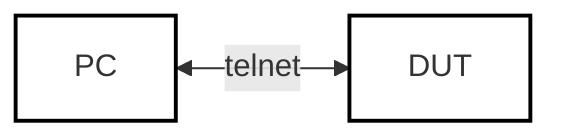
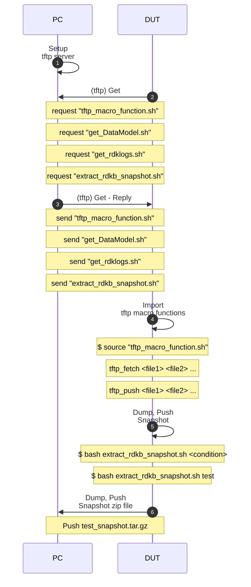

# rdkb-log-extractor

author: Terry Yu

brief: collect log from rdk-b based system

github: https://github.com/TUNGHUAYU/rdkb-log-extractor

[toc]

## Layout

The following content list all shell scripts in this project:

```bash
.
├── extract_rdkb_snapshot.sh	# compress data model and rdklogs and push 
├── get_DataModel.sh			# get data model (DM)
├── get_rdklogs.sh				# get rdklogs data 
├── readme.md					# this document
└── tftp_macro_function.sh		# macro function of tftp

0 directories, 5 files
```


## workflow


Hardware Layout




Sequence Diagram




