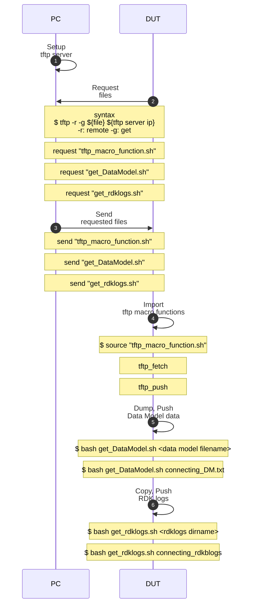

# rdkb-log-extractor

author: Terry Yu

brief: collect log from rdk-b based system

github: https://github.com/TUNGHUAYU/rdkb-log-extractor

[toc]


## workflow





## Appendices

### Appendix A. tftp_macro_function.sh


```bash
read -p "Please key in the tftp server ip: " tftp_server_ip
echo "tftp_server_ip: ${tftp_server_ip}"

function tftp_fetch(){
	if [[ $# -ne 1 ]];then
		echo "syntax error"
		echo "fetch <filename>"
		return 1
	else
		filename=$1
	fi

	echo "fetching ..."
	echo "tftp -g -r ${filename}" ${tftp_server_ip}
	tftp -g -r ${filename} ${tftp_server_ip}
	echo "finish"	
}

function tftp_push(){
	
	file_paths=$@
	prev_path=$(pwd)

	for file_path in ${file_paths}
	do

		dir_path=$(dirname ${file_path})
		file_name=$(basename ${file_path})
		
		echo "move to ${dir_path}"
		cd ${dir_path}

		echo "pushing ${file_path} ..."
		echo "tftp -p -l ${file_name} ${tftp_server_ip}"
		tftp -p -l ${file_name} ${tftp_server_ip}
		echo "done"
	done

	echo "go back ${prev_path}"
	cd ${prev_path}

}
```


### Appendix B. get_DataModel.sh


```bash
#!/bin/bash

# help message
function HELP(){
	echo "usage: $(basename $0) <data_model filename>"
}

# argument check
if [[ $# != 1 ]];then
	HELP
	exit 1
fi

# argument assignment
file_name=$1

# import tftp macro functions
source tftp_macro_function.sh

# setup path
dir_path=$(pwd)
file_path="${dir_path}/${file_name}"

# get data model via dmcli
echo "dmcli eRT getv Device. 2>&1 | tee ${file_path}"
dmcli eRT getv Device. 2>&1 | tee ${file_path}

# push to tftpd
echo "tftp_push ${file_path}"
tftp_push ${file_path}
```


### Appendix C. get_rdklogs.sh


```bash
#!/bin/bash

# help message
function HELP(){
	echo "usage: $(basename $0) <rdklogs dir name>"
}

# argument check
if [[ $# != 1 ]];then
	HELP
	exit 1
fi

# argument assignment
dst_dir_path="$(pwd)/$1"
src_dir_path="/rdklogs/logs"

# create folder 
if [[ -d ${dst_dir_path} ]];then
	read -p "overwrite ${dst_dir_path}? (y/n)"
	if [[ ${REPLY} == "y" ]];then
		echo "rm ${dst_dir_path} -rf"
		rm ${dst_dir_path} -rf
	fi
fi

echo "mkdir ${dst_dir_path}"
mkdir ${dst_dir_path}

# import tftp macro functions
source tftp_macro_function.sh

# copy rdk logs 
echo "cp ${src_dir_path}/* ${dst_dir_path}"
cp ${src_dir_path}/* ${dst_dir_path}

# push to tftpd
echo "tftp_push ${dst_dir_path}/*"
tftp_push ${dst_dir_path}/*

```

